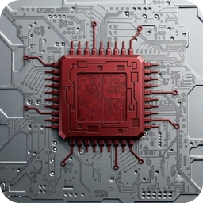
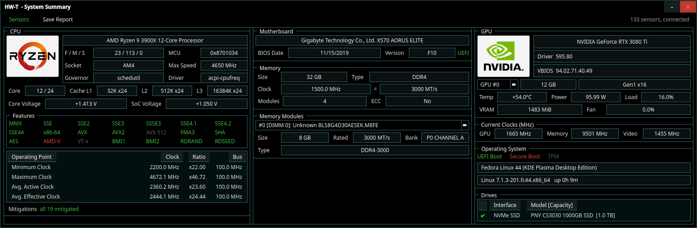
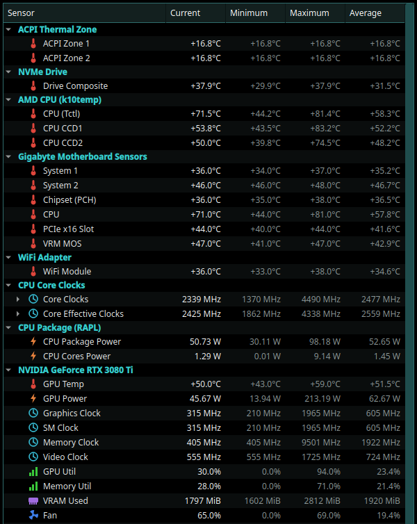

<h1 align="center">
  &nbsp;&nbsp;HW-T
</h1>

<p align="center"><strong>HWiNFO64-like hardware inventory and sensor monitoring suite for Linux.</strong></p>

<p align="center">
  
  
  
  
</p>

HW-T is a hardware monitoring suite for Linux, inspired by HWiNFO64. It
reads directly from the Linux kernel (`sysfs`) and from trusted vendor
tools to build a complete picture of your machine: the hardware inside it,
and what every sensor on it is reporting right now.

A background daemon collects everything in one place. You can watch the
values live in a native desktop app or in the terminal, query them from
scripts, log them to CSV, set temperature alerts, export full hardware
reports, or point Prometheus and Grafana at the built-in metrics endpoint.

## Why?

For years it annoyed me that Linux has no real equivalent of HWiNFO64.
The information itself is available, but it is spread across a dozen
separate utilities: `lm-sensors` for the motherboard, `smartctl` for
drives, `nvidia-smi` for the GPU, `dmidecode` for the BIOS and memory,
and so on. No single tool covers all of it. HW-T collects those sources
into one coherent view.

Two principles guide the design. First, HW-T is an aggregator and a
presenter. It reads hardware state through stable kernel interfaces and
proven tools, and it never reimplements drivers in userspace. Second, it
is strictly read-only. It will never write to fan controllers, embedded
controllers, or CPU registers.

## Features

- **Live sensors panel.** Every sensor on the system, grouped by chip,
  with current, minimum, maximum and average values. Available as a
  native desktop app (below), a terminal TUI, and a plain CLI table.
- **History buffers.** Every sensor keeps two hours of samples behind
  its current value, queryable with `hwtctl history` or the API. (The
  desktop app does not draw a graph from it yet.)
- **Stable sensor identity.** Sensors are identified by their position in
  the device tree, such as `hwmon:pci-0000:00:18.3:temp1`, never by
  kernel enumeration order. Settings and history survive reboots and
  kernel updates.
- **Hardware inventory.** CPU identity (model, family and stepping,
  microcode, L1/L2/L3 cache, instruction sets, security mitigations),
  operating system and platform (distribution, kernel, UEFI and Secure
  Boot state, TPM, total memory), BIOS, motherboard and memory details
  from SMBIOS, the full PCI bus with proper device names, USB devices,
  connected monitors, drive identity and capacity, and ECC memory
  controllers.
- **Alerts.** A rule fires when a value stays above or below a threshold
  for a set time, with hysteresis so it does not flap. Actions include
  desktop notifications, journal entries, shell hooks and webhooks.
- **Logging.** One CSV or NDJSON row per polling tick, HWiNFO style. You
  can insert named markers into a running log, for example "benchmark
  started".
- **Report export.** The complete inventory and sensor state as text,
  HTML, JSON, YAML or CSV. The HTML report is a single self-contained
  file, and `-redact` removes serial numbers before you share it.
- **Prometheus metrics.** Gauges like `hwt_temp_celsius` and
  `hwt_power_watts`, ready to graph in Grafana.
- **An API and a Go SDK.** Simple JSON over a Unix socket, including a
  live subscription stream. The client library lives in `pkg/client`.
- **Fault isolation.** If one data source misbehaves, the daemon
  quarantines it and everything else keeps running.

<p align="center">
  <br>
  <sub>System Summary: CPU, motherboard, memory and GPU at a glance</sub>
</p>

<p align="center">
  <br>
  <sub>Sensor Status: every sensor, current/min/max/avg, with an icon per kind</sub>
</p>

## Supported Hardware

The backbone is the kernel `hwmon` subsystem: any chip with a mainline
driver shows up in HW-T automatically. On top of that, dedicated
collectors cover:

| Subsystem | Read through | Notes |
|---|---|---|
| CPU temperatures | `k10temp` (AMD), `coretemp` (Intel) | per core and per CCD |
| CPU clocks | `cpufreq`, plus APERF/MPERF counters | effective clocks need root |
| CPU power | Intel and AMD RAPL | needs root |
| Motherboard sensors | `nct6775`, `it87`, `asus-ec-sensors`, `asus-wmi-sensors`, `gigabyte-wmi` | depends on the board |
| NVIDIA GPUs | `nvidia-smi` | temperature, power, clocks, load, VRAM, fan |
| AMD GPUs | `amdgpu` | hotspot and memory temperatures, load, VRAM, clocks |
| Intel GPUs (Arc and integrated) | `i915` / `xe` DRM sysfs, plus `hwmon` on Arc | clocks for all; power and energy where the driver exposes them |
| Drives | NVMe, `drivetemp`, `smartctl` | health and wear; never wakes a sleeping disk |
| Memory | SMBIOS, `jc42` / `spd5118` sensors, EDAC | ECC error counters included |
| Water cooling and PSUs | `corsair-psu`, `nzxt-*`, `aquacomputer_d5next` and other HID drivers | automatic |
| Monitors | EDID | model, serial, native mode, physical size |
| PCI and USB | `sysfs` plus the `hwdata` databases | link speed, driver, IOMMU group, AER errors |

Two things HW-T deliberately does not do: it does not control fans or RGB
(it is read-only by design, and CoolerControl already covers control
well), and it does not talk to exotic chips that have no kernel driver.
When a sensor cannot be read, HW-T tells you so instead of hiding it.

## Architecture

```
        +--------------------------------------------------+
        |  hwtd (daemon)                                    |
        |  providers: hwmon cpu rapl nvidia amdgpu smart    |
        |             pci usb edid edac dmi                 |
        |        v                                          |
        |  registry: stable IDs, min/max/avg, ring buffers  |
        |  alert engine, sensor logger, report generator    |
        +---+----------+-----------+----------------+------+
            |          |           |                |
        UDS API    /metrics    (clients)            |
            |          |                            |
       hwt-gui / hwt / hwtctl / pkg/client     Prometheus
```

There is one binary per role: `hwtd` is the daemon, `hwt-gui` the desktop
app, `hwt` the TUI, and `hwtctl` the command-line client. Everything
except the GUI is pure Go and builds with `CGO_ENABLED=0`.

## Installation

Packages for deb, rpm and the AUR are planned. For now, build from
source:

```
git clone https://github.com/zen66ten/HW-T.git
cd HW-T
go build ./cmd/hwtd ./cmd/hwt ./cmd/hwtctl
go build ./cmd/hwt-gui        # needs the GUI build deps below
```

Start the daemon. Root is recommended because SMBIOS, RAPL, effective
clocks and SMART all require it. Without root the daemon still runs and
simply skips what it cannot read:

```
sudo ./hwtd
```

Then use any client:

```
./hwt-gui                     # desktop app
./hwt                         # TUI
./hwtctl sensors              # one-shot table (-json for scripts)
./hwtctl devices              # inventory
./hwtctl report -format html -redact -o report.html
./hwtctl log start && ./hwtctl log mark "benchmark" && ./hwtctl log stop
curl localhost:11988/metrics  # Prometheus
```

Alert rules and poll rates live in `/etc/hw-t/config.toml`:

```toml
[[alert]]
name = "cpu-hot"
sensor = "hwmon:pci-0000:00:18.3:temp1"
above = 90.0
for = "10s"
hysteresis = 5.0
actions = ["journal", "notify"]
```

A hardened systemd unit ships in `packaging/systemd/hwtd.service`.

## Prerequisites

At runtime everything is optional. If a piece is missing, HW-T degrades
gracefully and reports what it could not read.

- A Linux kernel with `hwmon` support, which is any modern kernel. Load
  your board's Super-I/O module (`nct6775`, `it87`, ...) to get
  motherboard voltage and fan sensors.
- `smartmontools`, for drive health.
- The NVIDIA proprietary driver, for NVIDIA GPU telemetry.
- `hwdata`, for PCI and USB device names. Most distros preinstall it.
- On AMD Ryzen, the `zenpower` (Zen/Zen+/Zen2) or `zenpower3` (adds Zen3)
  out-of-tree driver, for CPU core and SoC voltage, current and power.
  The in-tree `k10temp` reports temperatures only, so without `zenpower`
  the CPU voltage fields stay blank. It binds the same PCI device as
  `k10temp`, so blacklist `k10temp` when loading it.

  ```
  # Fedora (COPR akmod, rebuilds against each kernel)
  sudo dnf copr enable shdwchn10/zenpower3
  sudo dnf install kernel-devel-$(uname -r) zenpower3
  echo 'blacklist k10temp' | sudo tee /etc/modprobe.d/zenpower.conf
  sudo systemctl reboot
  # Arch: the zenpower3-dkms AUR package. Elsewhere: build the DKMS
  # module from source.
  ```

Building needs Go 1.26 or newer. The GUI (`hwt-gui`) additionally needs
CGO and the Qt 6 development files (headers, `moc`, pkg-config data);
everything else is pure Go and builds with `CGO_ENABLED=0`:

```
# Fedora
sudo dnf install gcc-c++ qt6-qtbase-devel
# Debian/Ubuntu
sudo apt install g++ qt6-base-dev
# Arch
sudo pacman -S gcc qt6-base
```

At runtime, `hwt-gui` needs only the Qt 6 base libraries, which the devel
packages above already pull in; a plain end user would install the
runtime package instead (`qt6-qtbase` on Fedora, `libqt6widgets6` on
Debian/Ubuntu).

For development, providers read from a configurable `sysfs` root, so the
captured fixture trees in `testdata/` exercise the same code paths as
real hardware:

```
go test ./...
./hwtd -sysfs testdata/fixtures/basic/sys
```

## Dependencies

Everything under `internal/` and `pkg/` is pure Go with no third-party
runtime dependencies of its own. The direct module dependencies, one per
binary or subsystem that needs them:

| Module | Used by | Purpose |
|---|---|---|
| [`mappu/miqt`](https://github.com/mappu/miqt) | `hwt-gui` | Go bindings to Qt 6, the desktop GUI toolkit |
| [`charmbracelet/bubbletea`](https://github.com/charmbracelet/bubbletea) | `hwt` | Terminal UI framework |
| [`charmbracelet/lipgloss`](https://github.com/charmbracelet/lipgloss) | `hwt` | Terminal styling for the TUI |
| [`pelletier/go-toml/v2`](https://github.com/pelletier/go-toml) | `hwtd` | Parses `/etc/hw-t/config.toml` |
| [`prometheus/client_golang`](https://github.com/prometheus/client_golang) | `hwtd` | Serves the `/metrics` endpoint |
| [`gopkg.in/yaml.v3`](https://github.com/go-yaml/yaml) | `internal/core` | YAML report format (`hwtctl report -format yaml`) |
| [`golang.org/x/sys`](https://pkg.go.dev/golang.org/x/sys) | `internal/providers/cpu`, `internal/providers/system` | Low-level syscalls (`uname`, `sysinfo`) not in the standard library |

See `go.mod` for the full transitive graph. None of it replaces a
hardware driver or vendor tool; the non-Go dependencies HW-T actually
talks to (`nvidia-smi`, `smartctl`, `hwdata`, the kernel itself) are
listed under Prerequisites above.

## License

MIT, see [LICENSE](LICENSE).
