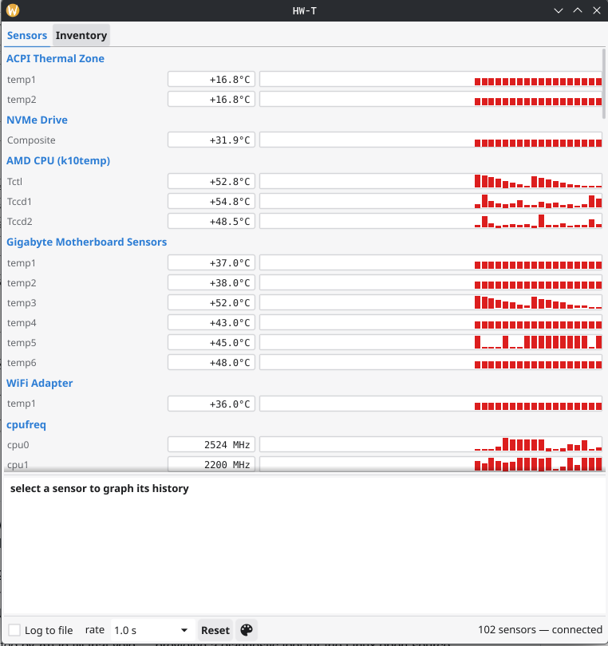

<h1 align="center">
  &nbsp;&nbsp;HW-T
</h1>

<p align="center"><strong>HWiNFO64-like hardware inventory and sensor monitoring suite for Linux.</strong></p>

<p align="center">
  
  
  
  
</p>

HW-T combines deep hardware inventory with real-time sensor monitoring in
one tool. A root daemon aggregates every data source the kernel and vendor
utilities offer — hwmon, cpufreq, effective per-core clocks (APERF/MPERF),
RAPL power, NVIDIA and AMD GPUs, drive SMART health, DMI/SMBIOS, PCI, USB,
monitor EDID, ECC counters — and serves it to a native desktop GUI, a TUI,
a scripting CLI, Prometheus metrics, and a Unix-socket API, with sensor
logging, threshold alerts, and full report export.

## Why?

The lack of a HWiNFO64 equivalent on Linux always annoyed me. The
information all exists, but it is scattered across a dozen utilities —
lm-sensors, smartctl, nvidia-smi, dmidecode, inxi, EDID parsers — and not
one tool covers all of HWiNFO's functions. HW-T pulls those pieces into a
single authoritative view.

By design, HW-T is an **aggregator and presenter**: it reads hardware
state through stable kernel interfaces and trusted vendor tools, and never
reimplements drivers in userspace. It is also strictly **read-only against
hardware** — no PWM writes, no EC pokes, no MSR writes.

## Features

- **Sensors panel** — every sensor grouped by chip with current/min/max/avg
  since reset, in three flavors: a native GPU-Z-style desktop app (below),
  a terminal TUI, and a one-shot CLI table
- **Rolling graphs** — per-row bar history in the GUI plus a 2-hour ring
  buffer behind every sensor, one click away
- **Stable sensor identity** — IDs derive from device topology
  (`hwmon:pci-0000:00:18.3:temp1`), never from `hwmonN` enumeration order,
  so customizations and history survive reboots and kernel updates
- **Hardware inventory** — BIOS/board/RAM (SMBIOS), full PCI bus with
  hwdata names, link speeds and IOMMU groups, USB devices, monitors
  (EDID), drive identity, ECC memory controllers
- **Alerts** — above/below rules with sustain duration and hysteresis;
  actions: desktop notification, journal, rate-limited exec hook
  (privilege-dropped), webhook
- **Logging** — HWiNFO-style CSV or NDJSON, one row per tick, with
  `log mark "note"` annotations and size rotation
- **Report export** — full inventory + sensor state as text, HTML
  (single self-contained file), JSON, YAML, or CSV, with `-redact` for
  serials/UUIDs/MACs
- **Prometheus/OpenMetrics** — `hwt_temp_celsius`, `hwt_power_watts`, ...
  ready for Grafana; provider health and alert state included
- **API & SDK** — newline-JSON over a Unix socket with a subscription
  stream; Go client package in `pkg/client`
- **Crash-isolated providers** — a misbehaving data source is quarantined,
  never takes down the daemon



## Supported Hardware

Anything with a mainline kernel `hwmon` driver appears automatically —
that is the backbone. On top of that:

| Subsystem | Source | Notes |
|---|---|---|
| CPU temperatures | `k10temp` (AMD), `coretemp` (Intel) | per-core / per-CCD |
| CPU clocks | cpufreq + APERF/MPERF via perf | effective clock needs root |
| CPU/package power | Intel/AMD RAPL (powercap) | needs root (kernel policy) |
| Motherboard sensors | Super-I/O drivers: `nct6775`, `it87`, `asus-ec-sensors`, `asus-wmi-sensors`, `gigabyte-wmi` | board-dependent |
| NVIDIA GPUs | `nvidia-smi` (proprietary driver) | temp, power, clocks, util, VRAM, fan |
| AMD GPUs | `amdgpu` hwmon + DRM sysfs | incl. junction/mem temps, busy %, VRAM, DPM clocks |
| Intel GPUs | `i915`/`xe` hwmon | via the hwmon backbone |
| Drives | NVMe hwmon, `drivetemp` (SATA) + `smartctl` | health, wear, media errors; never wakes standby disks |
| Memory | DMI type 17 + `jc42`/`spd5118` DIMM temp sensors | ECC error counters via EDAC |
| PSUs / AIOs / fan hubs | mainline hid hwmon drivers (`corsair-psu`, `nzxt-*`, `aquacomputer_d5next`, ...) | appears automatically |
| Monitors | EDID over DRM connectors | model, serial, native mode, size |
| PCI / USB | sysfs + hwdata databases | link speed/width, driver, IOMMU group, AER errors |

Not covered (deliberately): fan/RGB **control** (v1 is read-only;
CoolerControl owns that space), and userspace port-I/O to exotic chips
without kernel drivers — gaps surface explicitly instead of silently.

## Architecture

```
        +--------------------------------------------------+
        |  hwtd (daemon)                                    |
        |  providers: hwmon cpu rapl nvidia amdgpu smart    |
        |             pci usb edid edac dmi                 |
        |        v                                          |
        |  registry: stable IDs, min/max/avg, ring buffers  |
        |  alert engine · sensor logger · report generator  |
        +---+----------+-----------+----------------+------+
            |          |           |                |
        UDS API    /metrics    (clients)            |
            |          |                            |
       hwt-gui / hwt / hwtctl / pkg/client     Prometheus
```

One binary per role: `hwtd` (daemon), `hwt-gui` (desktop), `hwt` (TUI),
`hwtctl` (CLI). Everything except the GUI is pure Go, `CGO_ENABLED=0`.

## Installation

Packages (deb/rpm/AUR) are planned. For now, build from source:

```
git clone https://github.com/zen66ten/HW-T.git
cd HW-T
go build ./cmd/hwtd ./cmd/hwt ./cmd/hwtctl
go build ./cmd/hwt-gui        # needs the GUI build deps below
```

Run the daemon (root recommended — unlocks SMBIOS, RAPL, effective
clocks, SMART; degrades gracefully without):

```
sudo ./hwtd
```

Then any client:

```
./hwt-gui                     # desktop app
./hwt                         # TUI
./hwtctl sensors              # one-shot table (-json for scripts)
./hwtctl devices              # inventory
./hwtctl report -format html -redact -o report.html
./hwtctl log start && ./hwtctl log mark "benchmark" && ./hwtctl log stop
curl localhost:11988/metrics  # Prometheus
```

Alert rules and poll cadences live in `/etc/hw-t/config.toml`:

```toml
[[alert]]
name = "cpu-hot"
sensor = "hwmon:pci-0000:00:18.3:temp1"
above = 90.0
for = "10s"
hysteresis = 5.0
actions = ["journal", "notify"]
```

A hardened systemd unit ships in `packaging/systemd/hwtd.service`.

## Prerequisites

**Runtime** (all optional — missing pieces degrade gracefully):

- Linux kernel with `hwmon` (any modern kernel; load your board's
  Super-I/O module for motherboard sensors)
- `smartmontools` — drive health
- NVIDIA proprietary driver — NVIDIA GPU telemetry (`nvidia-smi`)
- `hwdata` — PCI/USB device names (preinstalled on most distros)

**Building**: Go 1.24+. The GUI additionally needs CGO and windowing
headers:

```
# Fedora
sudo dnf install gcc mesa-libGL-devel libX11-devel libXcursor-devel \
  libXrandr-devel libXinerama-devel libXi-devel libXxf86vm-devel \
  wayland-devel libxkbcommon-devel wayland-protocols-devel
# Debian/Ubuntu
sudo apt install gcc libgl1-mesa-dev xorg-dev libwayland-dev libxkbcommon-dev
```

**Development**: providers read from a configurable sysfs root, so
captured fixture trees exercise the same code paths as real hardware:

```
go test ./...
./hwtd -sysfs testdata/fixtures/basic/sys
```

## License

MIT — see [LICENSE](LICENSE).
